# Canonical Generative AI Samples

See all the concepts you've learned in action in these real-world and practical samples.

---

## What you'll achieve

- See how GenAI fits into existing applications.
- Understand how Agents work in complex scenarios.

## Included samples
- [Canonical Generative AI Samples](#canonical-generative-ai-samples)
  - [What you'll achieve](#what-youll-achieve)
  - [Included samples](#included-samples)
  - [eShopLite Demos](#eshoplite-demos)
    - [eShopLite with semantic search - In Memory](#eshoplite-with-semantic-search)
    - [eShopLite with semantic search - Azure AI Search](#eshoplite-with-semantic-search-using-azure-ai-search)
    - [eShopLite with realtime audio](#eshoplite-with-realtime-audio)
  - [Creative Writer Agent](#creative-writer-agent)
  - [Summary](#summary)
    - [Additional resources](#additional-resources)
    - [Next steps](#next-steps)


[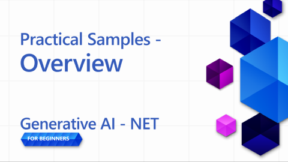](https://aka.ms/genainnet/videos/lesson4-overview)

_⬆️Click the image to watch the video⬆️_

## eShopLite Demos

For our first demos, we'll explore the **eShopLite** projects. **eShopLite** is a simple e-commerce application for outdoor gear and camping enthusiasts that is augmented with Generative AI capabilities, such as search features optimization, customer support, and real-time audio analysis.

These demos use [Azure OpenAI](https://azure.microsoft.com/products/ai-services/openai-service) and [Azure AI Foundry Models](https://ai.azure.com/) to do their inferences (or the generative AI portion) for the applications.

In the first demo, we show how to use the Semantic Kernel to enhance the search capabilities, which can understand the context of the user's queries and provide accurate results.

### eShopLite with semantic search

[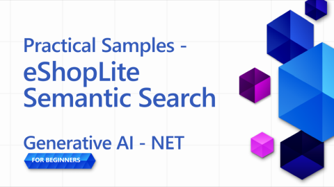](https://aka.ms/genainnet/videos/lesson4-eshoplite-semanticsearch)

_⬆️Click the image to watch the video⬆️_

In eShopLite with semantic search, we use Semantic Kernel to enhance the search capabilities of the e-commerce application. Semantic Kernel helps us create a more robust search engine that can understand the context of the user's queries and provide more accurate results.

For example, if a user searches for "do you have something for cooking", the search engine can understand that the user is looking for kitchenware and show the most relevant products, in context of our sample, it returns Camping Cookware.

> 🧑‍💻**Sample**: Check out the [eShopLite semantic search sample](https://aka.ms/netaieshoplitesemanticsearch)

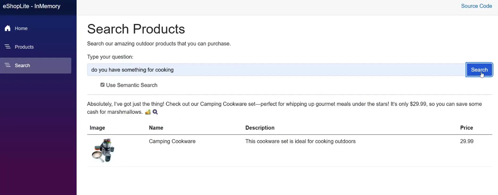

Semantic search can help users find the products they need more easily, leading to a better shopping experience and increased sales, to implement this feature, we need to have a vector store with the products, a search index, and a language model. The [.NET Aspire](https://learn.microsoft.com/dotnet/aspire/get-started/aspire-overview) tooling helps to coordinate all the processes in the backend.

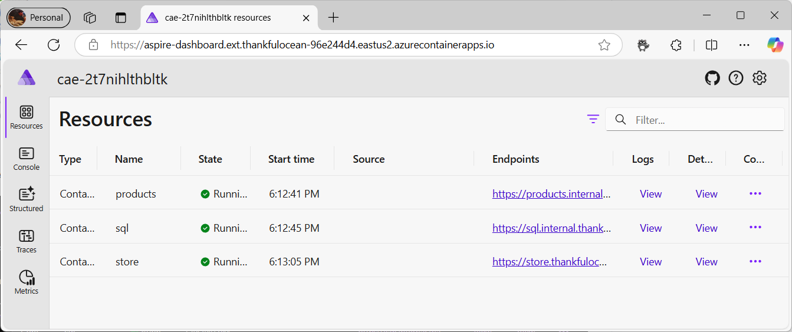

In the .NET Aspire dashboard, we can see the products, SQL, and store containers, which can interact with the language model. Looking deeper into the Aspire App Host, we have the following:

```csharp
if (builder.ExecutionContext.IsPublishMode)
{
    // Add the Azure Application Insights for monitoring
    var appInsights = builder.AddAzureApplicationInsights("appInsights");
    // Add the Azure OpenAI for the chat and embeddings deployments, the embedding is used for the vector entities
    var chatDeploymentName = "gpt-4o-mini";
    var embeddingsDeploymentName = "text-embedding-ada-002";
    var aoai = builder.AddAzureOpenAI("openai")
        .AddDeployment(new AzureOpenAIDeployment(chatDeploymentName,
        "gpt-4o-mini",
        "2024-07-18",
        "GlobalStandard",
        10))
        .AddDeployment(new AzureOpenAIDeployment(embeddingsDeploymentName,
        "text-embedding-ada-002",
        "2"));

    products.WithReference(appInsights)
        .WithReference(aoai)
        .WithEnvironment("AI_ChatDeploymentName", chatDeploymentName)
        .WithEnvironment("AI_embeddingsDeploymentName", embeddingsDeploymentName);

    store.WithReference(appInsights)
        .WithExternalHttpEndpoints();
}
```

The code above demonstrates how to add the Azure Application Insights for monitoring, the Azure OpenAI for the chat and embeddings deployments, and the embedding used for the vector entities.

For embedding and AOAI creation, it can be found at the product container, as follows:

```csharp
var azureOpenAiClientName = "openai";
builder.AddAzureOpenAIClient(azureOpenAiClientName);

// get azure openai client and create Chat client from aspire hosting configuration
builder.Services.AddSingleton<ChatClient>(serviceProvider =>
{
    var chatDeploymentName = "gpt-4o-mini";
    var logger = serviceProvider.GetService<ILogger<Program>>()!;
    logger.LogInformation($"Chat client configuration, modelId: {chatDeploymentName}");
    ChatClient chatClient = null;
    try
    {
        OpenAIClient client = serviceProvider.GetRequiredService<OpenAIClient>();
        chatClient = client.GetChatClient(chatDeploymentName);
    }...
}
```

The code above demonstrates how to get the Azure OpenAI client and create the Chat client from the Aspire hosting configuration. The `chatDeploymentName` is the name of the deployment used in the application. The same process is used to create the Embedding client, as follows:

```csharp
// get azure openai client and create embedding client from aspire hosting configuration
builder.Services.AddSingleton<EmbeddingClient>(serviceProvider =>
{
    var embeddingsDeploymentName = "text-embedding-ada-002";
    var logger = serviceProvider.GetService<ILogger<Program>>()!;
    logger.LogInformation($"Embeddings client configuration, modelId: {embeddingsDeploymentName}");
    EmbeddingClient embeddingsClient = null;
    try
    {
        OpenAIClient client = serviceProvider.GetRequiredService<OpenAIClient>();
        embeddingsClient = client.GetEmbeddingClient(embeddingsDeploymentName);
    }...
});
```

With it we can create the `MemoryContext`, as our vector store to compare to the user's query, and return the most relevant products, as follows:

```csharp
// Iterate over the products and add them to the memory
_logger.LogInformation("Adding product to memory: {Product}", product.Name);
var productInfo = $"[{product.Name}] is a product that costs [{product.Price}] and is described as [{product.Description}]";

// Create a new product vector
var productVector = new ProductVector
{
    Id = product.Id,
    Name = product.Name,
    Description = product.Description,
    Price = product.Price,
    ImageUrl = product.ImageUrl
};

// Generate the embedding for the product information
var result = await _embeddingClient.GenerateEmbeddingAsync(productInfo);

// Convert the embedding result to a float array and assign it to the product vector
productVector.Vector = result.Value.ToFloats();
var recordId = await _productsCollection.UpsertAsync(productVector);
_logger.LogInformation("Product added to memory: {Product} with recordId: {RecordId}", product.Name, recordId);
```

The code above demonstrates how to iterate over the products and add them to the memory.

After we create a new product vector, we use it to generate embedding for the product information, convert the embedding result to a float array, and assign it to the product vector.

Look at `_productsCollection`, it is a reference to the container where the products are stored, using a CosmosDB call to get the response for the recordId. For in this case, for logging.

The product is then added to the memory, repeating the process for each product in the collection.

After that, when the user searches for a product, we can compare the user's query with the product vectors and return the most relevant products.

```csharp
try
{
    // Generate embedding for the search query
    var result = await _embeddingClient.GenerateEmbeddingAsync(search);
    var vectorSearchQuery = result.Value.ToFloats();

    var searchOptions = new VectorSearchOptions()
    {
        Top = 1, // Retrieve the top 1 result
        VectorPropertyName = "Vector"
    };

    // Search the vector database for the most similar product
    var searchResults = await _productsCollection.VectorizedSearchAsync(vectorSearchQuery, searchOptions);
    double searchScore = 0.0;
    await foreach (var searchItem in searchResults.Results)
    {
        if (searchItem.Score > 0.5)
        {
            // Product found, retrieve the product details
            firstProduct = new Product
            {
                Id = searchItem.Record.Id,
                Name = searchItem.Record.Name,
                Description = searchItem.Record.Description,
                Price = searchItem.Record.Price,
                ImageUrl = searchItem.Record.ImageUrl
            };

            searchScore = searchItem.Score.Value;
            responseText = $"The product [{firstProduct.Name}] fits with the search criteria [{search}][{searchItem.Score.Value.ToString("0.00")}]";
            _logger.LogInformation($"Search Response: {responseText}");
        }
    }

    // Generate a friendly response message using the found product information
    var prompt = @$"You are an intelligent assistant helping clients with their search about outdoor products. Generate a catchy and friendly message using the following information:
    - User Question: {search}
    - Found Product Name: {firstProduct.Name}
    - Found Product Description: {firstProduct.Description}
    - Found Product Price: {firstProduct.Price}
    Include the found product information in the response to the user question.";

    var messages = new List<ChatMessage>
    {
        new SystemChatMessage(_systemPrompt),
        new UserChatMessage(prompt)
    };

    _logger.LogInformation("{ChatHistory}", JsonConvert.SerializeObject(messages));

    var resultPrompt = await _chatClient.CompleteChatAsync(messages);
}
```

With the code above, we generate the embedding for the search query, search the vector database for the most similar product, and get a response message using the found product information.

Helping the user find the products they need more easily, leading to a better shopping experience and increased sales.

Moreover, as generative AI evolves, we need some telemetry and monitoring to understand the user's behavior and improve the search engine, this is where Azure Application Insights and .NET Aspire come in.

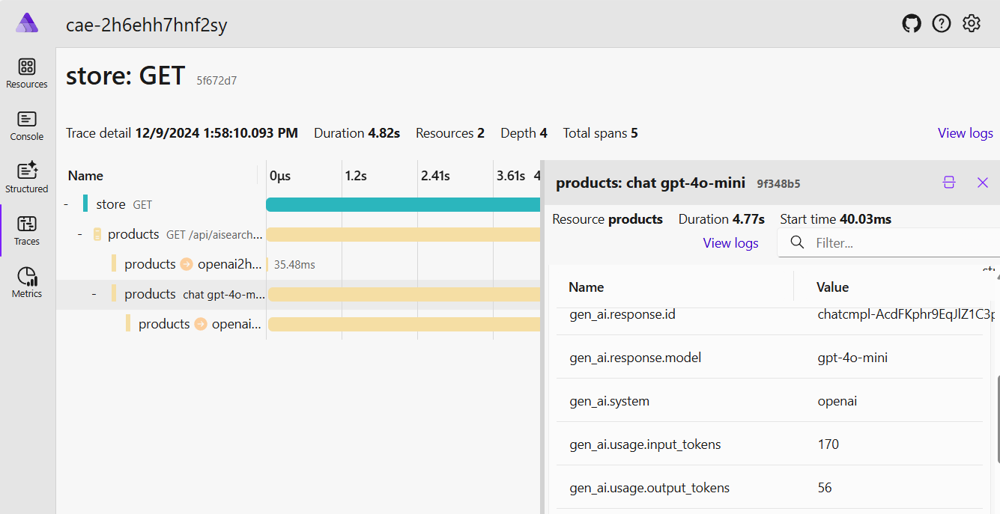

.NET Aspire provides a powerful set of tools to monitor and trace the application's behavior, including the user's interactions with the search engine, backend services, and the AI models. The tracing capabilities can help us understand possible bottlenecks, errors, and performance issues, allowing us to optimize the application and provide a better user experience.

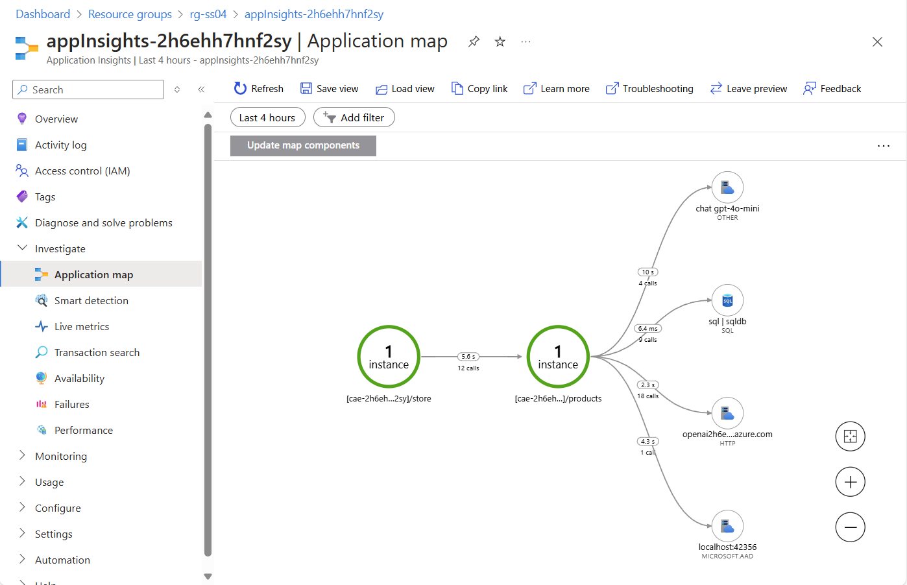

As telemetry is essential to understand the user's behavior and improve services, we introduce Azure Application Insights to monitor the application's performance and user interactions.

Application Insights provides a comprehensive set of telemetry data, helping us to understand how our services are performing, and how users are interacting with the application and cloud usage.

In the image, we can see the Application Insights dashboard, providing how the services are performing, for example, the calls for our Database, number of requests, and the response time.

> 💡 **Pro Tip**: For more information on eShopLite with Semantic Search, look at the repository to learn more: https://aka.ms/netaieshoplitesemanticsearch

### eShopLite with semantic search using Azure AI Search

In eShopLite end-to-end demo, we use **Azure AI Search** to enhance the search capabilities of the e-commerce application. Azure AI Search helps us create a more robust search engine that can understand the context of the user's queries and provide more accurate results.

It also provides a more scalable and reliable search engine that can handle large amounts of data and user queries. Azure AI Search allows the solution to persist the search indexes, so the information will be available even if the application is restarted.

- [eShopLite with Azure AI Search](https://aka.ms/netaieshoplitesemanticsearchazureaisearch)

### eShopLite with realtime audio

[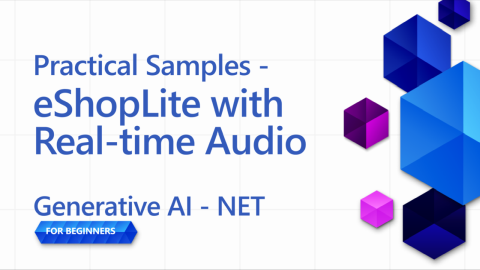](https://aka.ms/genainnet/videos/lesson4-eshoplite-realtimeaudio)

_⬆️Click the image to watch the video⬆️_

In eShopLite with real-time audio, we use the real-time audio capabilities of GPT-4o to analyze the conversations between the customer and the chatbot, providing a more personalized and engaging experience. For example, if a customer asks for a product recommendation, the chatbot can analyze the customer's request in real-time and provide a more accurate and relevant response.

> 🧑‍💻**Sample**: Check out the [eShopLite semantic search sample](https://aka.ms/netaieshopliterealtimechat)

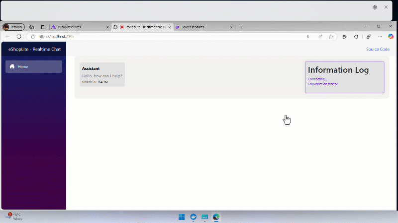

To implement this feature, we need to implement new features to create the endpoints for the Realtime Analysis, it can be found on the `StoreRealtime\ConversationManager.cs` implementation for real-time analysis.

```csharp
public async Task RunAsync(
    Stream audioInput, 
    Speaker audioOutput, 
    Func<string, Task> addMessageAsync, 
    Func<string, bool, Task> addChatMessageAsync, 
    CancellationToken cancellationToken)
{
    // Define the initial prompt for the assistant
    var prompt = $"""
        You are a useful assistant.
        Respond as succinctly as possible, in just a few words.
        Check the product database and external sources for information.
        The current date is {DateTime.Now.ToLongDateString()}
        """;
```

First, we define the initial prompt for the assistant, providing the user with instructions on how to interact with the chatbot. Remember to use prompts that are clear and concise, prompt engineering is essential to get accurate results from the AI models.

```csharp
// Notify the user that the connection is being established
await addMessageAsync("Connecting...");

// Send an initial greeting message
await addChatMessageAsync("Hello, how can I help?", false);

// Create AI functions for semantic search and product name search
var contosoSemanticSearchTool = AIFunctionFactory.Create(_contosoProductContext.SemanticSearchOutdoorProductsAsync);
var contosoSearchByProductNameTool = AIFunctionFactory.Create(_contosoProductContext.SearchOutdoorProductsByNameAsync);

// Add the AI functions to a list of tools
List<AIFunction> tools = new List<AIFunction> { contosoSemanticSearchTool, contosoSearchByProductNameTool };
```

We then notify the user that the chat is ready to start and send an initial greeting message. Then, AI functions to search products, semantic search, and search by product name are created and added to a list of tools. Which could be used to provide the user with relevant information on their queries.

```csharp
// Configure the conversation session options
var sessionOptions = new ConversationSessionOptions()
{
    Instructions = prompt,
    Voice = ConversationVoice.Shimmer,
    InputTranscriptionOptions = new() { Model = "whisper-1" },
};

// Add each tool to the session options
foreach (var tool in tools)
{
    sessionOptions.Tools.Add(tool.ToConversationFunctionTool());
}

// Start the conversation session with the configured options
session = await client.StartConversationSessionAsync(cancellationToken);
await session.ConfigureSessionAsync(sessionOptions);

// Initialize a StringBuilder to store the output transcription
var outputTranscription = new StringBuilder();
```

The conversation session options are configured, including the instructions, voice, and input transcription options. Using the `Whisper-1` model for the input transcription.

Each tool is added to the session options, and the conversation session is started with the configured options. Those can be changed to fit the user's needs.

> 🧑‍💻**Sample**: Check out the [eShopLite semantic search sample](https://aka.ms/netaieshopliterealtimechat)

## Creative Writer Agent

[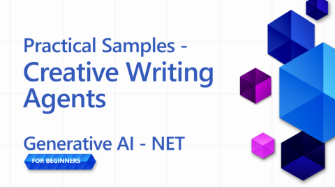](https://aka.ms/genainnet/videos/lesson4-creative-writer-agents)

_⬆️Click the image to watch the video⬆️_

Agents are a big topic in the current AI landscape, and to demonstrate their capabilities, we'll use the Creative Writer Agent, a tool that can generate creative and engaging text based on the user's input, helping to write researched, specific, and engaging content.

> 🧑‍💻**Sample**: Check out the [Creative Writing Agent sample code](https://aka.ms/netaicreativewriter)

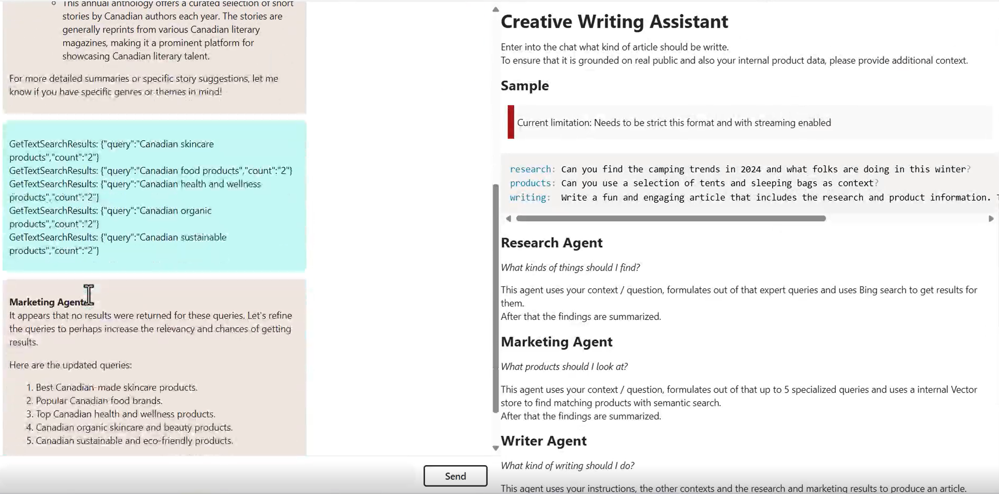

This solution centers on four dedicated modules that combine to generate high-quality content:

- Researcher: Leverages Bing search to gather context, topics, and data, then concisely summarizes it.
- Marketing: Interprets user intent, constructs relevant questions, and taps into the Vector DB for precise results.
- Writer: Synthesizes findings from Researcher and Marketing, producing a cohesive writing of the article.
- Editor: Assesses the draft, offers corrections, and decides whether it’s publication-ready.

The workflow integrates relevant data, effective messaging, and review, being orchestrated by Semantic Kernel, Microsoft AI Extension, and .NET Aspire.

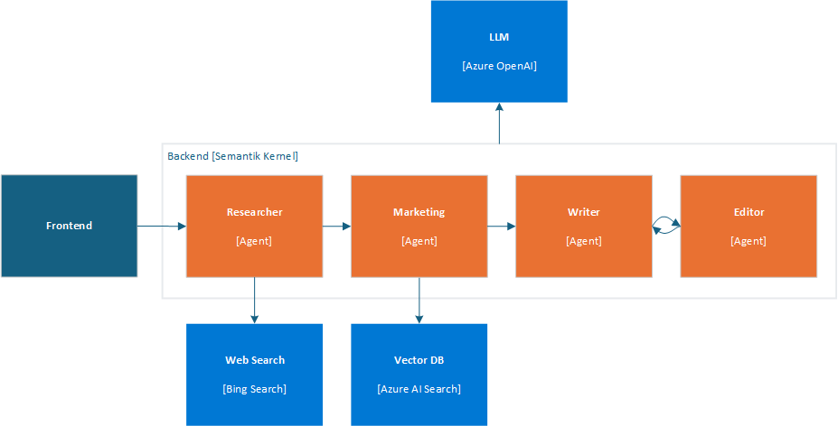

Understanding how the components interact with each other can be a reference for creating your own Agentic applications, take a look at the code below to understand how the components interact with each other, first look at the ChatController.cs call to the Creative Writer:

```csharp
var userInput = request.Messages.Last();

// Deserialize the user input content into a CreateWriterRequest object
CreateWriterRequest createWriterRequest = _yamlDeserializer.Deserialize<CreateWriterRequest>(userInput.Content);

// Create a new session for the Creative Writer application
var session = await _creativeWriterApp.CreateSessionAsync(Response);

// Process the streaming request and write the response in real-time
await foreach (var delta in session.ProcessStreamingRequest(createWriterRequest))
{
    // Serialize the delta and write it to the response stream and flush
    await response.WriteAsync($"{JsonSerializer.Serialize(delta)}\r\n");
    await response.Body.FlushAsync();
}
```

The type `CreateWriterRequest` needs to have three properties: `Research`, `Products`, and `Writing`. After getting them set by processing the request, it calls the `CreateSessionAsync` method, which looks like this:

```csharp
internal async Task<CreativeWriterSession> CreateSessionAsync(HttpResponse response)
{
    // Add custom function invocation filters to handle response modifications
    defaultKernel.FunctionInvocationFilters.Add(new FunctionInvocationFilter(response));

    // Create a separate kernel for Bing search integration and intialize the Bing service, and create a plugin for Bing search
    Kernel bingKernel = defaultKernel.Clone();
    BingTextSearch textSearch = new(apiKey: configuration["BingAPIKey"]!);
    KernelPlugin searchPlugin = textSearch.CreateWithSearch("BingSearchPlugin");
    bingKernel.Plugins.Add(searchPlugin);

    // Clone the default kernel to set up the vector search capabilities, and create the vector search kernel
    Kernel vectorSearchKernel = defaultKernel.Clone();
    await ConfigureVectorSearchKernel(vectorSearchKernel);

    // Return a new session encapsulating all configured kernels for comprehensive AI functionalities
    return new CreativeWriterSession(defaultKernel, bingKernel, vectorSearchKernel);
}
```

Now, we can see the `CreativeWriterSession` class for the `ProcessStreamingRequest` function, to understand how the components interact with each other, first look at the `Research` and `Marketing` components:

```csharp
// Initialize the Researcher Agent with a specific prompt template.
// This agent leverages the Bing Kernel for enhanced semantic search capabilities.
ChatCompletionAgent researcherAgent = new(ReadFileForPromptTemplateConfig("./Agents/Prompts/researcher.yaml"))
{
    Name = ResearcherName,
    Kernel = bingKernel,
    Arguments = CreateFunctionChoiceAutoBehavior(),
    LoggerFactory = bingKernel.LoggerFactory
};

// Initialize the Marketing Agent with its own prompt template.
// This agent utilizes the Vector Search Kernel to handle product-related queries efficiently.
ChatCompletionAgent marketingAgent = new(ReadFileForPromptTemplateConfig("./Agents/Prompts/marketing.yaml"))
{
    Name = MarketingName,
    Kernel = vectorSearchKernel,
    Arguments = CreateFunctionChoiceAutoBehavior(),
    LoggerFactory = vectorSearchKernel.LoggerFactory
};

// ...

// Invoke the Researcher Agent asynchronously with the provided research context.
await foreach (ChatMessageContent response in researcherAgent.InvokeAsync(
    new object[] { }, 
    new Dictionary<string, string> { { "research_context", createWriterRequest.Research } }))
{
    // Aggregate the research results for further processing or display.
    sbResearchResults.AppendLine(response.Content);
    
    yield return new AIChatCompletionDelta(Delta: new AIChatMessageDelta
    {
        Role = AIChatRole.Assistant,
        Context = new AIChatAgentInfo(ResearcherName),
        Content = response.Content,
    });
}

// ...

// Invoke the Marketing Agent with the provided product context.
await foreach (ChatMessageContent response in marketingAgent.InvokeAsync(
    new object[] { },
    new Dictionary<string, string> { { "product_context", createWriterRequest.Products } }))
{
    // Consolidate the product-related results for use in marketing strategies or user feedback.
    sbProductResults.AppendLine(response.Content);
    
    yield return new AIChatCompletionDelta(Delta: new AIChatMessageDelta
    {
        Role = AIChatRole.Assistant,
        Context = new AIChatAgentInfo(MarketingName),
        Content = response.Content,
    });
}
```
Now, we initialize and configure the `Writer` and `Editor` agents. Look at the code:

```csharp
// Initialize the Writer Agent with its specific prompt configuration
ChatCompletionAgent writerAgent = new(ReadFileForPromptTemplateConfig("./Agents/Prompts/writer.yaml"))
{
    Name = WriterName, 
    Kernel = kernel, /
    Arguments = new Dictionary<string, string>(), 
    LoggerFactory = kernel.LoggerFactory 
};

// Initialize the Editor Agent with its specific prompt configuration
ChatCompletionAgent editorAgent = new(ReadFileForPromptTemplateConfig("./Agents/Prompts/editor.yaml"))
{
    Name = EditorName, 
    Kernel = kernel, 
    LoggerFactory = kernel.LoggerFactory
};

// Populate the Writer Agent with contextual data required for generating content, gathered from the User, Researcher and Marketing Agents
writerAgent.Arguments["research_context"] = createWriterRequest.Research;
writerAgent.Arguments["research_results"] = sbResearchResults.ToString();
writerAgent.Arguments["product_context"] = createWriterRequest.Products;
writerAgent.Arguments["product_results"] = sbProductResults.ToString();
writerAgent.Arguments["assignment"] = createWriterRequest.Writing;

// Configure the Agent Group Chat to manage interactions between Writer and Editor
AgentGroupChat chat = new(writerAgent, editorAgent)
{
    LoggerFactory = kernel.LoggerFactory,
    ExecutionSettings = new AgentGroupChatSettings
    {
        // Define the strategy for selecting which agent interacts next
        SelectionStrategy = new SequentialSelectionStrategy() 
        { 
            InitialAgent = writerAgent // Start the conversation with the Writer Agent
        },
        // Define the termination condition for the agent interactions, in this case, the Editor Agent will terminate the conversation
        TerminationStrategy = new NoFeedbackLeftTerminationStrategy()
    }
};
```

In .NET Aspire, we notice how the components are orchestrated to create a seamless experience for the user. The tracing feature allows us to monitor the interactions between the agents, and the telemetry feature provides insights into the user's behavior and the performance of the AI models.

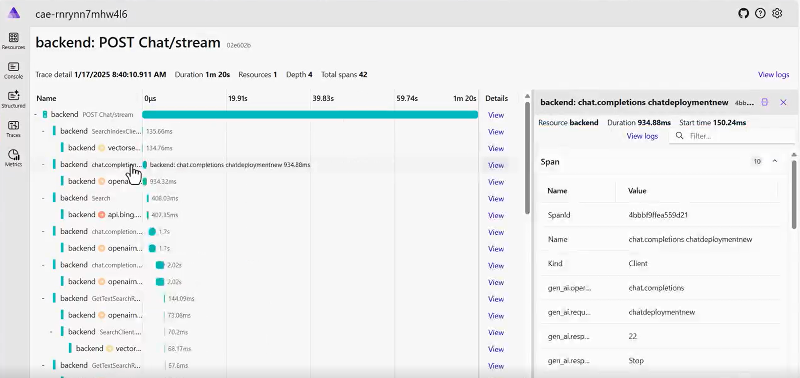

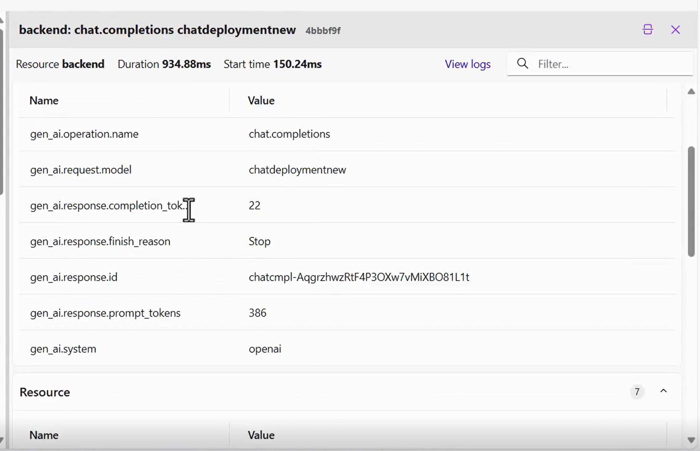

> 🧑‍💻**Sample**: Check out the [Creative Writing Agent sample code](https://aka.ms/netaicreativewriter)

## Summary

Those are just a few examples of how you can use GenAI in your applications. The possibilities are endless, and the technology is evolving rapidly, look at some of our resources to learn more about GenAI and how you can use it in your projects.

> 🙋 **Need help?**: If you encounter any issues, open an issue in the repository.

### Additional resources

- [eShopLite with DeepSeek](https://aka.ms/netaieshoplitedeepseekr1)
- [eShopLite with Azure AI Search](https://aka.ms/netaieshoplitesemanticsearchazureaisearch)

### Next steps

Learn about responsible AI practices and how to ensure that your AI models are ethical and have a positive impact!

👉 [Responsible AI](../05-ResponsibleGenAI/readme.md)
